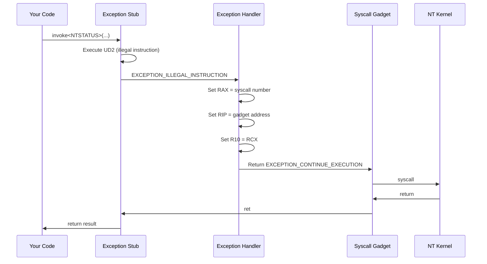

## Overview

The `generator::exception` policy uses Windows Vectored Exception Handlers (VEH) to intercept illegal instruction exceptions and redirect execution to syscalls. This creates an additional layer of indirection that can evade certain detection mechanisms.

## How It Works

The exception-based approach follows this flow:

1. **Setup**: Registers a VEH during manager initialization
2. **Stub Generation**: Creates stubs with illegal instructions (`UD2`)
3. **Execution**: When a stub runs, it triggers an exception
4. **Handler**: The VEH catches the exception and modifies CPU registers
5. **Redirection**: Execution continues at a syscall gadget with the correct syscall number

### Architecture



## Complete Example

```cpp
#include <iostream>
#include <syscalls-cpp/syscall.hpp>

int main() 
{
    // Create syscall manager with exception generator
    syscall::Manager<
        syscall::policies::allocator::section,
        syscall::policies::generator::exception
    > syscallManager;
    
    if (!syscallManager.initialize())
    {
        std::cerr << "initialization failed!\n";
        return 1;
    }

    std::cout << "VEH-based syscall manager initialized" << std::endl;

    // Allocate virtual memory
    PVOID pBaseAddress = nullptr;
    SIZE_T uSize = 0x1000;

    NTSTATUS status = syscallManager.invoke<NTSTATUS>(
        SYSCALL_ID("NtAllocateVirtualMemory"),
        syscall::native::getCurrentProcess(),
        &pBaseAddress,
        0, &uSize,
        MEM_COMMIT | MEM_RESERVE,
        PAGE_READWRITE
    );

    if (pBaseAddress)
        std::cout << "allocation successful at 0x" << pBaseAddress << std::endl;
    else
        std::cerr << "allocation failed, status: 0x" << std::hex << status << std::endl;

    return 0;
}
```

## Generated Stub

The exception generator creates minimal stubs:

```asm
ud2         ; 0x0F 0x0B - Illegal instruction (triggers exception)
ret         ; 0xC3 - Return (never reached during normal flow)
nop         ; Padding
```

The stub is only **8 bytes** - much smaller than direct or gadget approaches.

## Exception Handler Implementation

The VEH is registered during initialization:

```cpp
if (std::is_same_v<IStubGenerationPolicy, policies::generator::exception>)
{
    m_pVehHandle = AddVectoredExceptionHandler(1, VectoredExceptionHandler);
    if (!m_pVehHandle)
    {
        // Cleanup and fail initialization
        IAllocationPolicy::release(m_pSyscallRegion, m_hObjectHandle);
        m_pSyscallRegion = nullptr;
        m_bInitialized = false;
    }
}
```

### Handler Logic

The VEH inspects and modifies the exception context:

```cpp
static LONG NTAPI VectoredExceptionHandler(PEXCEPTION_POINTERS pExceptionInfo)
{
    // Only handle if we're expecting an exception
    if (!pExceptionContext.m_bShouldHandle)
        return EXCEPTION_CONTINUE_SEARCH;

    // Verify it's our illegal instruction exception
    if (pExceptionInfo->ExceptionRecord->ExceptionCode == EXCEPTION_ILLEGAL_INSTRUCTION &&
        pExceptionInfo->ExceptionRecord->ExceptionAddress == pExceptionContext.m_pExpectedExceptionAddress)
    {
        pExceptionContext.m_bShouldHandle = false;
        
        #if SYSCALL_PLATFORM_WINDOWS_64
        // Set up registers for syscall
        pExceptionInfo->ContextRecord->R10 = pExceptionInfo->ContextRecord->Rcx;
        pExceptionInfo->ContextRecord->Rax = pExceptionContext.m_uSyscallNumber;
        pExceptionInfo->ContextRecord->Rip = reinterpret_cast<uintptr_t>(pExceptionContext.m_pSyscallGadget);
        #else
        // x86 implementation
        uintptr_t uReturnAddressAfterSyscall = 
            reinterpret_cast<uintptr_t>(pExceptionInfo->ExceptionRecord->ExceptionAddress) + 2;
        pExceptionInfo->ContextRecord->Edx = pExceptionInfo->ContextRecord->Esp;
        pExceptionInfo->ContextRecord->Esp -= sizeof(uintptr_t);
        *reinterpret_cast<uintptr_t*>(pExceptionInfo->ContextRecord->Esp) = uReturnAddressAfterSyscall;
        pExceptionInfo->ContextRecord->Eip = reinterpret_cast<uintptr_t>(pExceptionContext.m_pSyscallGadget);
        pExceptionInfo->ContextRecord->Eax = pExceptionContext.m_uSyscallNumber;
        #endif

        return EXCEPTION_CONTINUE_EXECUTION;
    }

    return EXCEPTION_CONTINUE_SEARCH;
}
```

## Exception Context Guard

A RAII guard manages the thread-local exception context:

```cpp
class CExceptionContextGuard
{
public:
    CExceptionContextGuard(const void* pExpectedAddress, 
                          void* pSyscallGadget, 
                          uint32_t uSyscallNumber)
    {
        pExceptionContext.m_bShouldHandle = true;
        pExceptionContext.m_pExpectedExceptionAddress = pExpectedAddress;
        pExceptionContext.m_pSyscallGadget = pSyscallGadget;
        pExceptionContext.m_uSyscallNumber = uSyscallNumber;
    }

    ~CExceptionContextGuard()
    {
        pExceptionContext.m_bShouldHandle = false;
    }

    CExceptionContextGuard(const CExceptionContextGuard&) = delete;
    CExceptionContextGuard& operator=(const CExceptionContextGuard&) = delete;
};
```

This ensures exception handling is enabled only during syscall invocation:

```cpp
CExceptionContextGuard contextGuard(pStubAddress, pRandomGadget, it->m_uSyscallNumber);
return reinterpret_cast<Function_t>(pStubAddress)(std::forward<Args>(args)...);
```

## Security Benefits

<AccordionGroup>
  <Accordion title="Call Stack Obfuscation">
    The exception handler modifies the instruction pointer, creating a non-linear execution flow that's harder to trace and analyze.
  </Accordion>

  <Accordion title="No Direct Syscall Instructions">
    Your code never executes a syscall instruction directly. The stub only contains an illegal instruction.
  </Accordion>

  <Accordion title="Dynamic Gadget Selection">
    Each invocation can use a different random gadget from ntdll.dll, providing execution diversity.
  </Accordion>

  <Accordion title="Thread-Local Context">
    Using thread-local storage prevents race conditions and enables safe multi-threaded use.
  </Accordion>
</AccordionGroup>

## Use Cases

- **Advanced Evasion**: When you need maximum stealth
- **Research**: Studying exception-based execution techniques
- **Testing**: Validating security product behavior with non-standard execution flows
- **Obfuscation**: Making control flow analysis more difficult

## Performance Considerations

<Warning>
**Exception Overhead**: Exceptions are expensive operations. Each syscall invocation triggers an exception, which involves:

- Kernel transition to deliver the exception
- VEH chain traversal
- Context structure manipulation
- Return to user mode

Expect **10-100x slower** performance compared to direct syscalls.
</Warning>

### Performance Benchmarks

| Generator | Average Latency | Relative Speed |
|-----------|----------------|----------------|
| Direct | ~100ns | 1.0x (baseline) |
| Gadget | ~150ns | 1.5x slower |
| Exception | ~5-10μs | 50-100x slower |

## Limitations

<Warning>
1. **Performance**: Significantly slower due to exception handling overhead
2. **Debugging**: Harder to debug with a debugger attached (exceptions are noisy)
3. **Compatibility**: Some security products may detect or interfere with VEH manipulation
4. **Complexity**: Most complex implementation of the three generators
</Warning>

## Thread Safety

The implementation uses `thread_local` storage for the exception context:

```cpp
inline thread_local struct ExceptionContext_t
{
    bool m_bShouldHandle = false;
    const void* m_pExpectedExceptionAddress = nullptr;
    void* m_pSyscallGadget = nullptr;
    uint32_t m_uSyscallNumber = 0;
} pExceptionContext;
```

This ensures each thread has its own context and can safely invoke syscalls concurrently.

## Expected Output

```bash
$ ./exception-example.exe
VEH-based syscall manager initialized
allocation successful at 0x000002A1B2C3D000
```

## When to Use Exception-Based Syscalls

✅ **Use when:**
- You need maximum evasion capabilities
- Performance is not critical
- You're researching advanced techniques
- You want to test security product responses to unusual execution flows

❌ **Avoid when:**
- Performance matters
- You need simple, maintainable code
- You're working with high-frequency syscalls
- Debugging is a priority

## Comparison with Other Generators

| Feature | Direct | Gadget | Exception |
|---------|--------|--------|----------|
| Platform | x64 + x86 | x64 only | x64 + x86 |
| Performance | Fastest | Fast | Slow |
| Stealth | Low | High | Highest |
| Complexity | Simple | Moderate | Complex |
| Stub Size | 18 bytes | 32 bytes | 8 bytes |
| Debugging | Easy | Moderate | Hard |

## See Also

- [Direct Syscalls](/examples/direct-syscalls) - Fast, simple approach
- [Gadget Syscalls](/examples/gadget-syscalls) - Balanced stealth and performance
- [Custom Generators](/examples/custom-generators) - Build your own approach
- [Architecture](/core-concepts/architecture) - Framework design details
